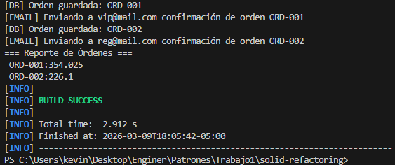

## Análisis de Violaciones SOLID
| Principio | Método/Sección afectada | Descripción de la violación |
|-----------|-------------------------|-----------------------------|
| SRP | calculateTotal + applyDiscount + saveOrder + sendEmail +
printReport | La clase OrderProcessor concentra múltiples responsabilidades: cálculo de totales, aplicación de descuentos, persistencia, notificación por correo y generación de reportes. Esto viola el principio de responsabilidad única porque la clase tiene varios motivos para cambiar. Por ejemplo, cambiar la regla de impuestos, el formato del reporte o el mecanismo de guardado impactaría la misma clase. |
| OCP | applyDiscount (if/else sobre customerType) | El uso de if sobre customerType obliga a modificar el método cada vez que aparezca un nuevo tipo de cliente o una nueva política de descuento. La clase no está cerrada a modificaciones; crecería con más condiciones como PREMIUM, EMPLOYEE, BLACK_FRIDAY, etc. Una solución más alineada con OCP sería encapsular cada estrategia de descuento en clases separadas. |
| DIP | Toda la clase (dependencias internas sin abstracciones) |
La clase depende de detalles concretos en lugar de abstracciones. Usa directamente ArrayList para almacenamiento y System.out.println para salida, persistencia simulada y notificación. Eso acopla la lógica de negocio a implementaciones específicas, dificultando pruebas, reemplazo de infraestructura y extensión del sistema. |

## Instructions to execute the project

I used this command cuz i´m poor (i don't have mac professor) --> mvn --% exec:java -Dexec.mainClass=com.patrones.u1.Main

mvn compile && mvn exec:java -Dexec.mainClass="com.patrones.u1.Main"

The first one worked for me. I'm not 100% sure about the second one, but I think it's the one you gave us in class.

## RESULT

